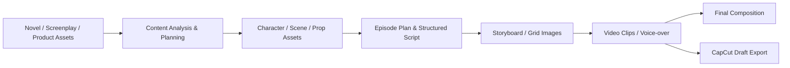
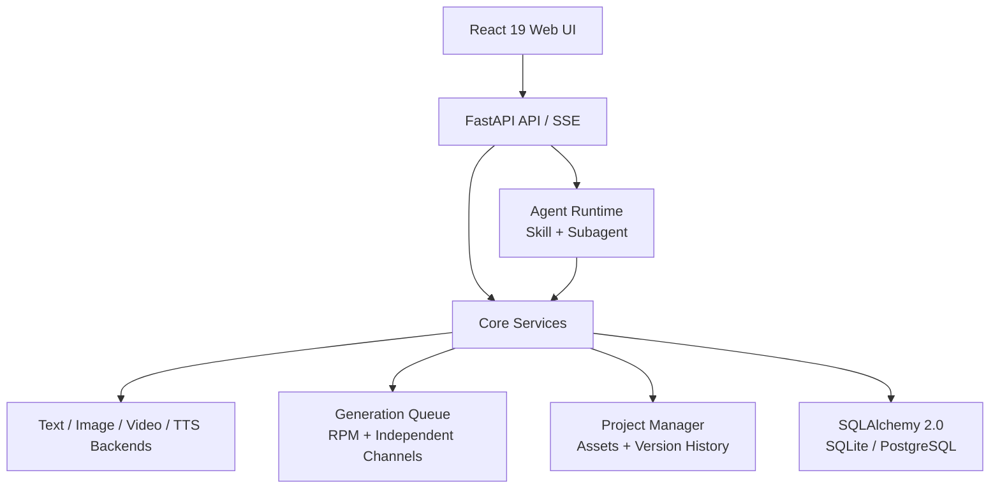

<h1 align="center">
  <br>
  <picture>
    <source media="(prefers-color-scheme: light)" srcset="frontend/public/android-chrome-maskable-512x512.png">
    <source media="(prefers-color-scheme: dark)" srcset="frontend/public/android-chrome-512x512.png">
    
  </picture>
  <br>
  ArcReel
  <br>
</h1>

<p align="center">
  <strong>An open-source, self-hosted AI video production workspace</strong>
  <br>
  Turn novels, finished screenplays, or product assets into consistent, controllable, cost-aware videos that remain editable.
</p>

<p align="center">
  <a href="README.md"></a>
  <a href="README.en.md"></a>
</p>

<p align="center">
  <a href="https://github.com/ArcReel/ArcReel/releases/latest"></a>
  <a href="https://github.com/ArcReel/ArcReel/actions/workflows/test.yml"></a>
  <a href="https://codecov.io/gh/ArcReel/ArcReel"></a>
  <a href="https://github.com/ArcReel/ArcReel/pkgs/container/arcreel"></a>
  <a href="LICENSE"></a>
  <a href="https://github.com/ArcReel/ArcReel"></a>
</p>

<p align="center">
  <a href="#quick-start"><strong>Quick Start</strong></a>
  ·
  <a href="docs/getting-started.md">Getting Started</a>
  ·
  <a href="docs/README.md">Documentation</a>
  ·
  <a href="#community">Community</a>
</p>

<p align="center">
  
</p>

> ArcReel is not a thin prompt wrapper. It organizes content analysis, screenplay structuring, character and scene assets, storyboards, media generation tasks, cost tracking, version history, and export into an inspectable and resumable production pipeline.

## What ArcReel solves

- **Content to final cut**: bring a novel, a finished screenplay, or product assets into one workspace and progressively produce characters, scenes, props, storyboards, video clips, and a final video.
- **Visual continuity**: establish character, scene, style, and prop references before generating downstream shots.
- **Human control**: review key stages, regenerate individual assets, and roll back to earlier versions.
- **Provider freedom**: manage multiple text, image, video, and TTS providers behind a unified interface.
- **Cost visibility**: estimate before generation and track actual usage by project, episode, and shot.
- **Editable delivery**: render a final video or export a CapCut draft for further editing.

## Best-fit workflows

<table>
<tr>
<td width="33%" valign="top">

### 🎭 AI drama and novel adaptation

Extract characters, locations, and plot structure from long-form fiction or finished screenplays, then produce visually consistent episodes.

</td>
<td width="33%" valign="top">

### 🎙️ Narrated short videos

Split content by narration rhythm, generate storyboards and voice-over tracks, and export a vertical video or editable CapCut draft.

</td>
<td width="33%" valign="top">

### 🛍️ Ads and product shorts

Upload multiple product images, build stable product references, and generate product-anchored promotional shots for a target duration.

</td>
</tr>
</table>

## From source to final video



Every stage can be orchestrated by the AI assistant while remaining reviewable and replaceable in the workspace. See [Workflows and Modes](docs/workflows.md) for guidance.

## Quick Start

### Prerequisites

- Docker and Docker Compose
- Start with at least 2 GB of available memory
- A complete workflow requires:
  - model credentials for the ArcReel AI assistant
  - working text, image, and video generation capabilities, provided by one multimodal provider or a combination of providers
  - optional TTS capability when narration is needed
- The default setup uses remote model APIs and normally does not require a local GPU; local model deployments have their own requirements

### Default deployment: SQLite

```bash
git clone https://github.com/ArcReel/ArcReel.git
cd ArcReel/deploy

cp .env.example .env
docker compose up -d
```

Verify the service:

```bash
docker compose ps
curl http://localhost:1241/health
```

Open <http://localhost:1241>.

The default username is `admin`. Set `AUTH_PASSWORD` in `deploy/.env`; when left empty, a password is generated on first startup and written back to the file.

After signing in:

1. Follow the onboarding tour and explore the read-only demo project.
2. Configure the model credentials used by the ArcReel AI assistant.
3. Configure the text, image, and video capabilities required by the full workflow.
4. Start with a small project to validate the workflow.

> The SQLite deployment is suitable for evaluation and light personal use. For long-running or concurrent environments, use the [PostgreSQL production deployment](docs/deployment.md#2-生产部署postgresql). PostgreSQL does not add user isolation; ArcReel does not currently support sharing one instance between mutually untrusted users.

### Production deployment: PostgreSQL

```bash
cd "$(git rev-parse --show-toplevel)/deploy/production"

cp .env.example .env
# Edit .env and set POSTGRES_PASSWORD, AUTH_PASSWORD, and AUTH_TOKEN_SECRET
docker compose up -d
```

See [Deployment and Operations](docs/deployment.md) for upgrades, backups, and reverse proxies. See the [Security Policy](SECURITY.md) for supported deployments and vulnerability reporting.

## Core capabilities

### 🤖 Agent-driven, resumable workflow

ArcReel uses an orchestration Skill and focused Subagents built on the Claude Agent SDK. The main Agent detects the current project stage and delegates character extraction, episode planning, screenplay normalization, and asset generation to focused workers.

### 🎨 Reusable character, scene, and prop assets

Character designs, style references, scene assets, and prop assets act as cross-shot references to reduce visual drift across generated media.

### 🎬 Three video-making workflows

- **Storyboard image-to-video**: generate from one storyboard image at a time for straightforward shot-by-shot review.
- **Storyboard sheet-to-video**: create several shots together on a storyboard sheet, split them into individual images, then generate each video; best when cross-shot consistency matters.
- **Reference-to-video**: generate directly from character, scene, and prop assets.

### ⚡ Asynchronous tasks and concurrency controls

Image, video, and audio jobs use independent concurrency channels with RPM limits, live status reporting, failure recovery, and resumable execution.

### 🕰️ Version history and project archives

Regeneration preserves earlier versions. Entire projects can be exported and imported for backup, migration, and handoff.

### 💰 Estimates and actual usage

Track calls and costs by provider and media type, preserve currency boundaries, and compare estimates with actual usage at project, episode, and shot levels.

### 🎙️ Voice-over and editable export

Generate and audition narration tracks, fill an episode in bulk, and export CapCut drafts containing video, voice-over, and subtitle tracks.

### 🔌 External Agent integration

ArcReel can issue `arc-` API keys and expose a synchronous Agent chat endpoint for platforms such as OpenClaw.

## Provider support

ArcReel hides provider differences behind `TextBackend`, `ImageBackend`, and `VideoBackend` protocols. Models, parameters, availability, and pricing change over time, so the **ArcReel Settings page and provider documentation are the source of truth**.

| Provider | Text | Image | Video | TTS |
|---|:---:|:---:|:---:|:---:|
| Gemini | ✅ | ✅ | ✅ | — |
| Volcengine Ark | ✅ | ✅ | ✅ | — |
| Grok | ✅ | ✅ | ✅ | — |
| OpenAI | ✅ | ✅ | ✅ | — |
| Vidu | — | ✅ | ✅ | — |
| DashScope | ✅ | ✅ | ✅ | ✅ |
| MiniMax | ✅ | ✅ | ✅ | — |
| Kling | — | ✅ | ✅ | — |
| Agnes | ✅ | ✅ | ✅ | — |
| Custom providers | Interface-dependent | Interface-dependent | Interface-dependent | Interface-dependent |

Global defaults, project-level overrides, and multiple API keys per provider are supported. See [Provider Configuration](docs/providers.md).

## Architecture



The stack includes React 19, TypeScript, FastAPI, Python 3.12+, the Claude Agent SDK, SQLAlchemy 2.0, FFmpeg, Docker, and Docker Compose. See [Architecture](docs/architecture.md) for boundaries and extension points.

## Important limitations

- Media generation depends on third-party services; speed, availability, policy, and pricing are provider-controlled.
- Long-form projects still benefit from human review of episode boundaries, character assets, and key plot decisions.
- Video providers differ in reference-image count, duration, start/end-frame support, audio support, and regional availability.
- Native Windows can run parts of the basic workflow, but POSIX-dependent Agent sandbox features degrade; prefer Linux, macOS, WSL2, or Docker.
- Production deployments should use PostgreSQL, HTTPS, strong credentials, and regular backups. Do not expose an unprotected port `1241` to the public Internet.

See [FAQ](docs/FAQ.md) for more.

## Documentation

Detailed documentation is currently maintained in Chinese; English documentation contributions are welcome.

| Document | Purpose |
|---|---|
| [Documentation Index](docs/README.md) | Entry points for creators, operators, and contributors |
| [Getting Started](docs/getting-started.md) | From first deployment to the first generated video |
| [Workflows and Modes](docs/workflows.md) | Novel, screenplay, narration, drama, ad, and video-making workflows |
| [Provider Configuration](docs/providers.md) | Agent, text, image, video, and TTS provider choices |
| [Deployment and Operations](docs/deployment.md) | SQLite, PostgreSQL, upgrades, backups, and reverse proxies |
| [Security Policy](SECURITY.md) | Supported versions, deployment boundaries, private reporting, and coordinated disclosure |
| [Security Threat Model](docs/security/threat-model.md) | Security assets, trust boundaries, attack surfaces, and reassessment triggers |
| [CapCut Draft Export](docs/jianying-export-guide.md) | Continue editing ArcReel output in CapCut |
| [Architecture](docs/architecture.md) | Agent runtime, queue, provider abstraction, and data layer |
| [FAQ](docs/FAQ.md) | Deployment, cost, data, model, and licensing questions |
| [Contributing](CONTRIBUTING.md) | Local development, tests, conventions, and pull requests |
| [Changelog](CHANGELOG.md) | Release history |

## Community

Scan the QR code to join the ArcReel Feishu community for help, release updates, and workflow discussions:

<p align="center">
  
</p>

Reproducible bugs and focused feature requests are welcome in [GitHub Issues](https://github.com/ArcReel/ArcReel/issues).

## Contributing

Contributions to code, documentation, tests, provider adapters, and reproducible bug reports are welcome.

Read [CONTRIBUTING.md](CONTRIBUTING.md) before starting. After cloning the repository, install the pre-commit hooks:

```bash
uv run pre-commit install
```

## License and commercial use

ArcReel is licensed under the [GNU Affero General Public License v3.0](LICENSE). Additional terms are available in [NOTICE](NOTICE).

For organizations that cannot use AGPL-3.0, or need commercial deployment, white-labeling, or redistribution without AGPL obligations, contact:

**support@arc-reel.com**

Copyright © 2026 Pollo3470 and ArcReel contributors

---

<p align="center">
  If ArcReel helps your work, consider giving the project a ⭐ Star.
</p>
