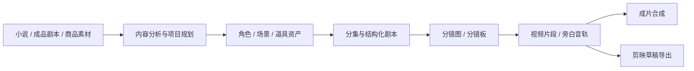
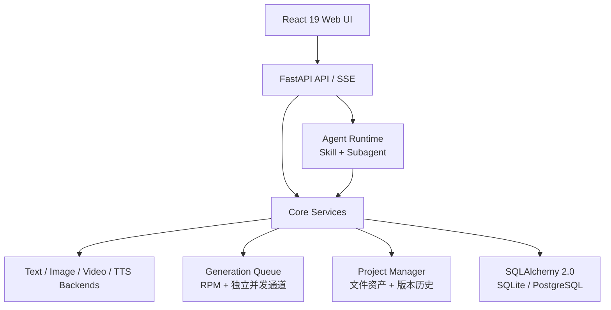

<h1 align="center">
  <br>
  <picture>
    <source media="(prefers-color-scheme: light)" srcset="frontend/public/android-chrome-maskable-512x512.png">
    <source media="(prefers-color-scheme: dark)" srcset="frontend/public/android-chrome-512x512.png">
    
  </picture>
  <br>
  ArcReel
  <br>
</h1>

<p align="center">
  <strong>开源、自托管的 AI 视频生产工作台</strong>
  <br>
  将小说、成品剧本或商品素材转化为角色一致、过程可控、成本可追踪、可继续编辑的短视频。
</p>

<p align="center">
  <a href="README.md"></a>
  <a href="README.en.md"></a>
</p>

<p align="center">
  <a href="https://github.com/ArcReel/ArcReel/releases/latest"></a>
  <a href="https://github.com/ArcReel/ArcReel/actions/workflows/test.yml"></a>
  <a href="https://codecov.io/gh/ArcReel/ArcReel"></a>
  <a href="https://github.com/ArcReel/ArcReel/pkgs/container/arcreel"></a>
  <a href="LICENSE"></a>
  <a href="https://github.com/ArcReel/ArcReel"></a>
</p>

<p align="center">
  <a href="#快速开始"><strong>快速开始</strong></a>
  ·
  <a href="docs/getting-started.md">入门教程</a>
  ·
  <a href="docs/README.md">完整文档</a>
  ·
  <a href="#交流群">加入社区</a>
</p>

<p align="center">
  
</p>

> ArcReel 不是一个简单的“提示词套壳”。它把内容分析、剧本结构化、角色与场景资产、分镜生成、视频任务、费用统计、版本回滚和成片导出组织成一条可审核、可中断恢复的生产流水线。

## ArcReel 能解决什么

- **从内容到成片**：小说、成品剧本或商品素材进入同一个工作台，逐步产出角色、场景、道具、分镜、视频片段和最终成片。
- **保持视觉连续性**：先沉淀角色、场景和关键道具参考资产，再让后续镜头持续引用，降低跨镜头漂移。
- **保留人的控制权**：关键阶段展示结果并等待确认，单个素材可以重做，历史版本可以回滚。
- **自由选择模型供应商**：统一管理多个文本、图像、视频和 TTS 供应商，也可以接入兼容 API。
- **控制生产成本**：生成前估算费用，生成后追踪调用量和实际成本，支持项目、剧集和镜头级查看。
- **保留后期空间**：既能合成最终视频，也能导出剪映草稿继续调整字幕、配音、节奏和转场。

## 适合的创作场景

<table>
<tr>
<td width="33%" valign="top">

### 🎭 AI 漫剧与小说改编

从长篇小说或成品剧本提取角色、场景和剧情结构，分集制作角色一致的剧集动画。

</td>
<td width="33%" valign="top">

### 🎙️ 说书与旁白短视频

按朗读节奏拆分内容，生成分镜、旁白音轨和竖屏视频，并导出可继续编辑的剪映草稿。

</td>
<td width="33%" valign="top">

### 🛍️ 广告与带货短片

上传商品多图，建立产品参考资产，按目标时长生成带货镜头脚本和产品锚定画面。

</td>
</tr>
</table>

## 从输入到成片



每个阶段都可以由 AI 助手编排，也可以由用户在工作台中审核、调整或重新生成。详细模式选择见 [创作流程与模式](docs/workflows.md)。

## 快速开始

### 准备工作

- Docker 和 Docker Compose
- 建议从 2 GB 可用内存起步
- 完整创作流程需要：
  - 一组用于 ArcReel AI 助手的模型凭据
  - 可用的文本、图像和视频生成能力（可以由一家全模态供应商提供，也可以组合多家供应商）
  - 按需配置的 TTS 能力
- 默认使用远程模型 API，通常不要求本机 GPU；接入本地模型时，资源要求由对应服务决定

### 默认部署：SQLite

```bash
git clone https://github.com/ArcReel/ArcReel.git
cd ArcReel/deploy

cp .env.example .env
docker compose up -d
```

检查服务状态：

```bash
docker compose ps
curl http://localhost:1241/health
```

然后访问 <http://localhost:1241>。

默认用户名为 `admin`。密码通过 `deploy/.env` 中的 `AUTH_PASSWORD` 设置；留空时，首次启动会自动生成并回写到 `.env`。

登录后进入 **设置** 页面：

1. 按首次使用引导浏览工作台和只读演示项目。
2. 配置 ArcReel AI 助手所使用的模型凭据。
3. 配置完整创作流程所需的文本、图像和视频生成能力。
4. 创建项目并从少量内容开始验证工作流。

> 默认部署适合个人体验和轻量使用。正式、并发或长期运行环境建议采用 [PostgreSQL 生产部署](docs/deployment.md#2-生产部署postgresql)。PostgreSQL 不提供用户隔离；ArcReel 目前不支持互不信任的用户共享同一实例。

### 生产部署：PostgreSQL

```bash
cd "$(git rev-parse --show-toplevel)/deploy/production"

cp .env.example .env
# 编辑 .env，并设置 POSTGRES_PASSWORD、AUTH_PASSWORD、AUTH_TOKEN_SECRET
docker compose up -d
```

部署、升级、备份和反向代理见 [部署与运维](docs/deployment.md)；支持边界和漏洞报告方式见 [安全政策](SECURITY.md)。

## 核心能力

### 🤖 Agent 驱动的可恢复工作流

基于 Claude Agent SDK 的编排 Skill 与聚焦 Subagent：主 Agent 识别项目所处阶段，把角色提取、分集规划、剧本规范化和资产生成分发给对应 Subagent，并只接收精炼结果。

### 🎨 角色、场景与道具资产

角色设计图、风格参考图以及场景和道具资产作为跨镜头参考源，减少人物外观、场景氛围和关键物品在不同镜头中的漂移。

### 🎬 三种视频制作方式

- **分镜图生视频**：以单张分镜图驱动视频生成，适合逐镜审核和调整。
- **分镜板生视频**：先在一张分镜板（宫格）中统一生成多个镜头，再切分为单镜头分镜图生成视频，适合多镜头一致性要求较高的场景。
- **参考生视频**：直接引用角色、场景和道具资产，跳过普通分镜步骤。

### ⚡ 异步任务与并发控制

图像、视频和音频任务拥有独立并发通道；支持 RPM 限速、任务状态跟踪、失败恢复和中断后的继续执行。

### 🕰️ 版本历史与项目归档

重新生成会保留历史版本；项目可整体导入和导出，便于备份、迁移以及不同环境之间交接。

### 💰 费用预估与实际用量

按供应商和媒体类型统计调用量，区分币种，并提供项目、剧集和镜头级的预估与实际费用对比。

### 🎙️ 旁白与后期导出

支持旁白 TTS、逐段试听和批量生成；剪映草稿导出可保留视频片段、旁白音轨和字幕轨，方便继续后期处理。

### 🔌 外部 Agent 集成

ArcReel 可以签发 `arc-` 前缀 API Key，并通过同步 Agent 对话端点供 OpenClaw 等外部 Agent 平台调用。

## 供应商支持

ArcReel 使用统一的 `TextBackend`、`ImageBackend` 和 `VideoBackend` 协议屏蔽供应商差异。具体可用模型、参数和计费信息会随供应商更新，**以 ArcReel 设置页和供应商官方文档为准**。

| 供应商 | 文本 | 图像 | 视频 | TTS |
|---|:---:|:---:|:---:|:---:|
| Gemini | ✅ | ✅ | ✅ | — |
| 火山方舟 | ✅ | ✅ | ✅ | — |
| Grok | ✅ | ✅ | ✅ | — |
| OpenAI | ✅ | ✅ | ✅ | — |
| Vidu | — | ✅ | ✅ | — |
| 阿里百炼 | ✅ | ✅ | ✅ | ✅ |
| MiniMax | ✅ | ✅ | ✅ | — |
| 可灵 Kling | — | ✅ | ✅ | — |
| Agnes | ✅ | ✅ | ✅ | — |
| 自定义供应商 | 取决于接口 | 取决于接口 | 取决于接口 | 取决于接口 |

支持全局默认和项目级覆盖，也支持为同一供应商管理多个 API Key。详细说明见 [供应商与模型配置](docs/providers.md)。

## 技术架构



技术栈包括 React 19、TypeScript、FastAPI、Python 3.12+、Claude Agent SDK、SQLAlchemy 2.0、FFmpeg、Docker 和 Docker Compose。架构边界与扩展方式见 [架构说明](docs/architecture.md)。

## 使用前需要了解的边界

- 媒体生成依赖第三方模型服务，生成速度、可用性、内容策略和成本受供应商影响。
- 长篇内容仍需要人工审核分集、角色资产和关键剧情节点，ArcReel 的目标是增强创作者，而不是完全取消审核。
- 不同视频模型对参考图数量、视频时长、首尾帧、音频和地区可用性的支持不同。
- Windows 原生环境可以运行部分基础流程，但 Agent 沙箱等 POSIX 能力会降级；优先使用 Linux、macOS、WSL2 或 Docker。
- 生产环境应使用 PostgreSQL、HTTPS、强密码和定期备份，不建议直接把未加保护的 `1241` 端口暴露到公网。

更多问题见 [常见问题](docs/FAQ.md)。

## 文档

| 文档 | 内容 |
|---|---|
| [文档导航](docs/README.md) | 按使用者、运维者和开发者整理的文档入口 |
| [完整入门教程](docs/getting-started.md) | 从首次部署到生成第一条视频 |
| [创作流程与模式](docs/workflows.md) | 小说、剧本、广告模式以及三种视频制作方式 |
| [供应商与模型配置](docs/providers.md) | Agent、文本、图像、视频、TTS 供应商的选择和配置 |
| [部署与运维](docs/deployment.md) | SQLite、PostgreSQL、升级、备份、反向代理 |
| [安全政策](SECURITY.md) | 支持版本、部署边界、私密漏洞报告和协调披露 |
| [安全威胁模型](docs/security/threat-model.md) | 安全资产、信任边界、攻击面和重评触发条件 |
| [剪映草稿导出](docs/jianying-export-guide.md) | 将 ArcReel 生成结果交给剪映继续编辑 |
| [架构说明](docs/architecture.md) | Agent Runtime、任务队列、供应商抽象和数据层 |
| [常见问题](docs/FAQ.md) | 部署、费用、模型、数据和许可证问题 |
| [贡献指南](CONTRIBUTING.md) | 本地开发、测试、代码规范和 PR 流程 |
| [更新记录](CHANGELOG.md) | 每个版本的功能和修复 |

## 交流群

扫码加入飞书交流群，获取使用帮助、版本动态和创作经验：

<p align="center">
  
</p>

遇到可以复现的 Bug 或明确的功能需求，也可以直接提交 [GitHub Issue](https://github.com/ArcReel/ArcReel/issues)。

## 贡献

欢迎贡献代码、文档、测试、供应商适配和问题复现。

开始开发前请阅读 [CONTRIBUTING.md](CONTRIBUTING.md)。本地克隆后建议立即安装项目的 pre-commit 钩子：

```bash
uv run pre-commit install
```

## 许可证与商业使用

ArcReel 采用 [GNU Affero General Public License v3.0](LICENSE)，附加条款见 [NOTICE](NOTICE)。

如果你的组织无法采用 AGPL-3.0，或者希望在不承担 AGPL 开源义务的情况下进行商业部署、白标或再分发，请联系：

**support@arc-reel.com**

Copyright © 2026 Pollo3470 and ArcReel contributors

---

<p align="center">
  如果 ArcReel 对你有帮助，欢迎点亮一个 ⭐ Star。
</p>
