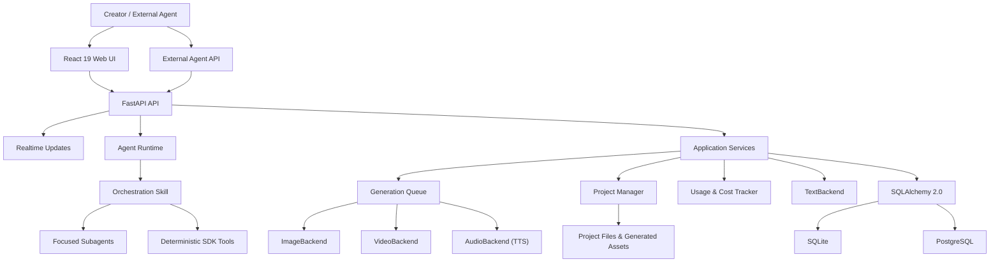
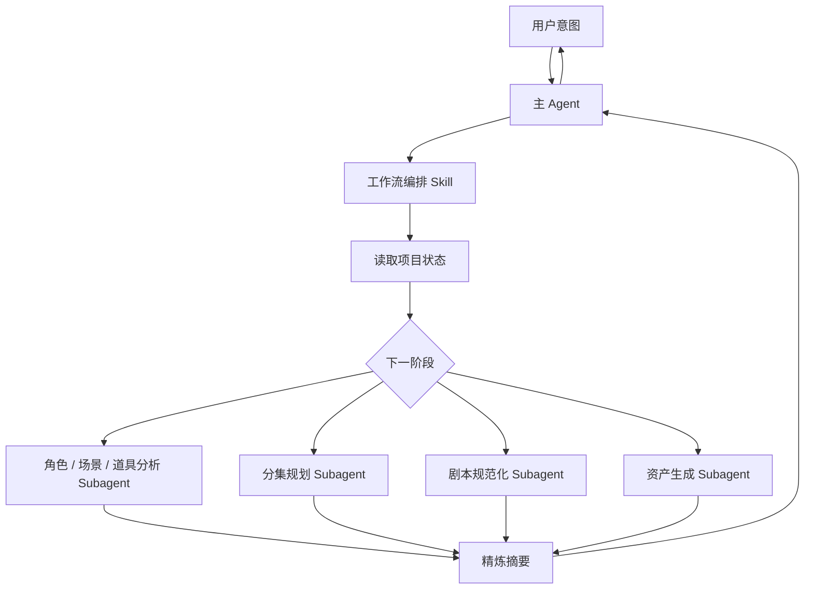
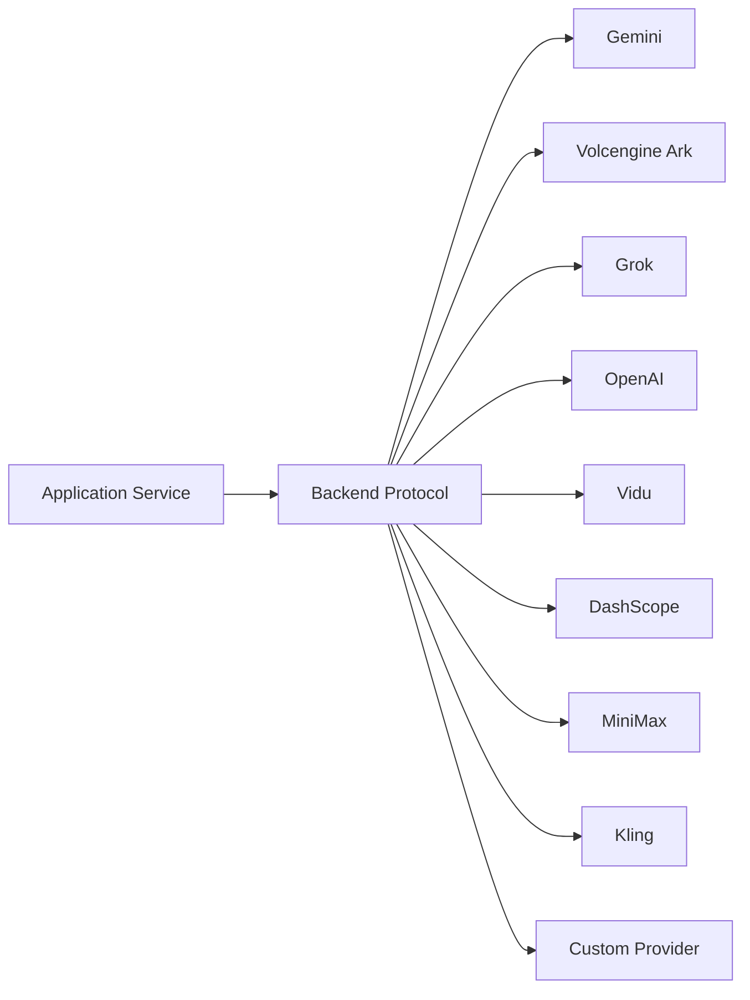

# 架构说明

本文档描述 ArcReel 的稳定架构边界、主要数据流和扩展点。它不替代代码级 API 文档，也不记录临时实现计划。

## 1. 架构目标

ArcReel 的核心目标不是绑定某个模型，而是提供一条：

- 可编排；
- 可审核；
- 可中断恢复；
- 可替换供应商；
- 可追踪成本；
- 可保留版本；
- 可继续后期编辑

的 AI 视频生产流水线。

## 2. 总体架构

## 3. 前端层

前端使用 React 19 和 TypeScript，主要职责包括：

- 项目列表和创建；
- 项目工作台；
- 素材预览；
- AI 助手对话；
- 任务状态；
- 费用统计；
- 设置和供应商管理；
- 版本历史；
- 项目导入和导出。

前端不应直接处理供应商密钥或绕过后端调用模型。

## 4. API 与实时状态

FastAPI 提供：

- REST API；
- 认证；
- 项目和资产操作；
- 任务创建与查询；
- Agent 对话；
- Agent 与项目事件 SSE；
- 生成任务查询；
- 外部 API Key 接入。

Agent 回复通过助手 SSE 流式返回；项目终态变化通过项目事件 SSE 触发界面刷新，生成任务的中间状态和断线兜底由任务查询补充。部署反向代理时必须关闭 SSE 代理缓冲并设置足够长的读取超时。

## 5. Agent Runtime

Agent Runtime 基于 Claude Agent SDK，并采用“编排 Skill + 聚焦 Subagent”的结构。

### 5.1 编排 Skill

负责：

- 判断项目当前状态；
- 选择下一步；
- 调用确定性工具；
- 分发 Subagent；
- 控制阶段边界；
- 在需要时等待用户确认。

编排层不应承担所有内容推理，否则会让主上下文快速膨胀。

### 5.2 聚焦 Subagent

每个 Subagent 聚焦一个任务，例如：

- 角色、场景和道具提取；
- 说书片段拆分；
- 剧集动画剧本规范化；
- 单集结构化剧本；
- 资产生成。

大量小说原文和中间推理尽量保留在 Subagent 内部，主 Agent 接收摘要和结果引用。

### 5.3 确定性工具

确定性操作更适合由工具或 Skill 执行，例如：

- 读取和写入项目文件；
- 创建任务；
- 查询状态；
- 生成结构化文件；
- 合成视频；
- 导出归档。

这类操作不应反复交给语言模型自由生成。

## 6. 应用服务层

应用服务协调：

- 项目；
- 剧集；
- 角色、场景和道具；
- 分镜；
- 媒体任务；
- 文件上传；
- 项目导入和导出；
- 剪映草稿；
- 费用和用量；
- 诊断信息。

服务层应依赖稳定协议，而不是直接向上层泄漏供应商 SDK 的具体对象。

## 7. 供应商抽象

ArcReel 使用：

- `TextBackend`
- `ImageBackend`
- `VideoBackend`
- `AudioBackend`

统一不同供应商的调用方式。

抽象层负责统一：

- 请求输入；
- 任务创建；
- 任务轮询；
- 输出位置；
- 统一错误；
- 用量信息；
- 费用计算入口。

供应商差异仍然存在，例如：

- 参数；
- 时长；
- 参考图数量；
- 异步任务状态；
- 失败语义；
- 计费单位。

正确做法是把这些差异封装在后端适配器和能力描述中，而不是假装所有供应商完全相同。

## 8. 生成任务队列

图像、视频和音频任务具有不同的成本和延迟特征，因此使用独立并发通道。

主要能力：

- 异步执行；
- RPM 限制；
- Image / Video / Audio 独立并发；
- 状态持久化；
- 中断恢复；
- 失败记录；
- 任务取消；
- 项目事件通知与任务状态刷新。

### 8.1 为什么需要持久化任务

模型调用可能持续数分钟。任务不能只存在于内存，否则进程重启会丢失：

- 已提交的远程任务 ID；
- 当前状态；
- 费用；
- 输出路径；
- 错误信息。

### 8.2 幂等性

创建和重试任务时应避免：

- 同一个镜头重复扣费；
- 远程任务已成功但本地重复提交；
- SSE 断开导致任务被认为失败；
- 重复点击产生相同的生成任务。

任务身份、持久化状态和供应商任务 ID 是处理这些问题的关键。

## 9. 项目和资产模型

ArcReel 的项目不仅是一条数据库记录，还包括文件系统中的媒体资产。

典型内容：

- 原始小说、剧本或商品素材；
- 项目配置；
- 角色、场景和道具定义；
- 参考图；
- 分镜；
- 视频片段；
- 音频；
- 合成输出；
- 历史版本；
- 导出归档。

应用数据根目录解析顺序：

1. `ARCREEL_DATA_DIR`
2. 兼容变量 `AI_ANIME_PROJECTS`
3. 默认 `projects/`

默认 SQLite 数据库也位于应用数据目录中。

## 10. 数据库

ArcReel 使用 SQLAlchemy 2.0 异步 ORM。

### SQLite

适合：

- 个人体验；
- 本地开发；
- 轻量单实例。

默认使用 WAL、忙等待超时和外键约束。

### PostgreSQL

适合：

- 生产环境；
- 较高并发；
- 长期运行；
- 更成熟的备份和恢复。

应用启动时运行 Alembic 迁移，将数据库升级到当前版本。

## 11. 版本历史

媒体生成具有不确定性，因此“重新生成”不应简单覆盖旧文件。

版本历史用于：

- 对比不同生成结果；
- 回滚；
- 保留已审核版本；
- 降低试错风险；
- 为项目归档提供完整上下文。

服务层应通过统一的资产版本接口操作，而不是让各供应商适配器自行决定如何覆盖文件。

## 12. 用量和费用

用量追踪跨越：

- 文本；
- 图片；
- 视频；
- TTS；
- 不同供应商；
- 不同币种；
- 预估和实际。

设计原则：

- 供应商适配器提供原始用量；
- 费用策略负责转换；
- 不同币种默认分开统计；
- 失败任务是否计费按供应商语义处理；
- ArcReel 记录不替代供应商官方账单。

## 13. 视频合成与剪映导出

媒体生成完成后有两种输出路径。

### 成片合成

使用 FFmpeg 处理：

- 片段拼接；
- 转场；
- 音频；
- 最终编码。

### 剪映草稿

导出可继续编辑的项目结构，用于：

- 调整片段；
- 编辑字幕；
- 替换配音；
- 增加音乐；
- 修改转场；
- 人工精修。

“可继续编辑”是 ArcReel 与只输出单个视频文件的生成工具之间的重要差异。

## 14. 认证和外部集成

ArcReel 提供：

- 用户名和密码登录；
- JWT；
- `arc-` 前缀 API Key；
- 外部 Agent 同步对话端点。

API Key 应使用哈希存储，不应在创建后以明文持续返回。

外部 Agent 集成应：

- 最小化权限；
- 限制可访问的项目；
- 记录调用；
- 支持撤销；
- 避免把管理员密码提供给第三方平台。

## 15. 沙箱和安全边界

Agent 工具可能访问：

- 文件系统；
- 网络；
- 子进程；
- FFmpeg；
- Bash 工具。

ArcReel 在支持的环境中使用 `bwrap` 等机制限制这些能力。Docker Compose 为沙箱配置了额外权限，因此生产部署需要在功能和宿主机隔离之间做清晰取舍。

安全原则：

- 默认最小权限；
- 文件和网络白名单；
- 不挂载 Docker Socket；
- 不挂载不必要的宿主机路径；
- 对外只暴露反向代理；
- 使用 HTTPS；
- 定期更新；
- 把未知项目输入视为不可信数据。

## 16. 扩展一个新供应商

一个完整的新供应商接入通常需要：

1. 定义能力和配置模型；
2. 实现对应 Backend 协议；
3. 统一错误类型；
4. 实现同步或异步任务生命周期；
5. 保存远程任务 ID；
6. 解析输出和用量；
7. 实现费用策略；
8. 接入设置页；
9. 添加单元和集成测试；
10. 更新供应商文档；
11. 验证取消、超时和重试。

不要只实现“成功路径”。视频供应商的轮询、超时、失败和重复提交往往比创建请求更复杂。

## 17. 扩展一个新工作流阶段

新阶段应回答：

- 输入是什么；
- 输出是什么；
- 是否可重复执行；
- 如何判断已完成；
- 是否需要用户确认；
- 失败后如何恢复；
- 是否产生费用；
- 是否需要版本历史；
- 主 Agent、Skill、Subagent 和确定性工具各负责什么。

一个阶段只有在完成条件可以由项目状态明确判断时，才能可靠地被编排和恢复。

## 18. 架构约束

建议长期保持以下约束：

- UI 不直接调用供应商；
- 业务服务不依赖供应商 SDK 返回对象；
- Agent 不直接拼接数据库 SQL；
- 供应商适配器不决定产品工作流；
- 重试不绕过幂等性；
- 费用记录与生成任务关联；
- 项目文件和数据库状态可共同备份；
- 具体模型名称不进入稳定领域接口；
- 长文本推理不无限累积在主 Agent 上下文；
- 确定性操作优先使用工具而不是自然语言生成。

## 19. 相关文档

- [创作流程与模式](workflows.md)
- [供应商与模型配置](providers.md)
- [部署与运维](deployment.md)
- [贡献指南](../CONTRIBUTING.md)
- [ADR 目录](adr/)
