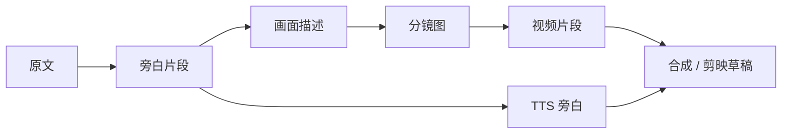

# 创作流程与模式

ArcReel 支持多种内容来源和视频生成方式。本页帮助你在项目开始前选择正确路径，并定义每个阶段的审核标准。

## 1. 两个需要分别选择的维度

创建项目时，需要区分：

1. **内容模式**：决定脚本如何组织；
2. **视频制作方式**：决定使用分镜图、分镜板还是资产参考图组织视频生产。

它们可以组合。例如：

- 剧集动画 + 图生视频；
- 剧集动画 + 参考生视频；
- 说书 + 图生视频；
- 广告短片 + 参考生视频。

## 2. 内容来源

### 2.1 小说原文

适合：

- 小说改编；
- 网文推文视频；
- 需要 AI 辅助分集和结构化剧本的项目。

ArcReel 会处理：

- 角色和别名；
- 关键场景；
- 关键道具；
- 剧情阶段；
- 分集边界；
- 镜头化描述。

建议：

- 第一次不要上传整部长篇小说；
- 先用一个剧情闭环的章节验证风格和供应商；
- 角色资产确认后再扩大制作范围。

### 2.2 成品剧本

适合：

- 已经拥有对白、旁白和场景说明；
- 希望尽量保留作者原稿；
- 只需要资产设计、分镜和媒体生成。

核心原则：

- 台词与画外音应尽量逐字保留；
- 角色以作者提供的人物表和剧本内容为依据；
- 群演和空镜不应自动膨胀为长期角色资产；
- 重点是规范化和镜头生产，而不是重新创作。

### 2.3 商品素材

适合：

- 带货短片；
- 产品演示；
- 广告脚本；
- 品牌短视频。

准备内容：

- 产品正面、侧面、细节和使用场景图片；
- 核心卖点；
- 目标人群；
- 禁止出现的表述；
- 品牌视觉要求；
- 目标时长和发布平台。

产品项目应优先建立稳定的商品参考资产，再生成场景化镜头。

## 3. 内容模式

### 3.1 说书模式

#### 特点

- 旁白是主要信息载体；
- 画面为叙事和氛围服务；
- 按朗读节奏和语义停顿拆分；
- 更适合竖屏、节奏较快的短视频。

#### 推荐流程

#### 审核重点

- 单段旁白是否过长；
- 每个画面是否承载一个清晰信息点；
- 画面是否只是机械复述旁白；
- 专有名词和人物名的 TTS 发音；
- 旁白与画面时长是否匹配。

#### 适用情况

- 小说推文；
- 历史、故事和知识类内容；
- 旁白主导的产品介绍；
- 对角色口型要求不高的项目。

### 3.2 剧集动画模式

#### 特点

- 场景、角色、对白和动作是主要结构；
- 更强调角色一致性和镜头衔接；
- 适合 AI 漫剧、剧情短片和成品剧本动画化。

#### 推荐流程

#### 审核重点

- 每集是否有完整目标和情绪变化；
- 角色出场和服装是否连续；
- 镜头空间关系是否稳定；
- 台词、动作和镜头时长是否匹配；
- 相邻镜头视线和运动方向是否连续。

#### 适用情况

- 小说改编；
- 连续剧式 AI 漫剧；
- 角色驱动的剧情短片；
- 已有对白剧本的动画化。

### 3.3 广告/短片模式

#### 特点

- 目标时长明确；
- 围绕卖点、使用场景和行动号召组织镜头；
- 产品真实性和参考一致性优先；
- 可生成口播文案、字幕和剪映草稿，配音在导出后完成。

#### 推荐流程

#### 审核重点

- 产品外形、Logo、颜色和结构是否真实；
- 卖点是否有事实依据；
- 镜头是否过度依赖生成模型补全产品细节；
- 首屏是否快速说明产品价值；
- 结尾是否有明确行动号召；
- 口播文案和字幕是否符合平台规范。

## 4. 视频制作方式

### 4.1 分镜图生视频

以单张分镜图作为视频输入。

#### 优点

- 工作流最直观；
- 供应商覆盖通常最广；
- 易于针对单个镜头重做；
- 分镜审核与视频生成职责清晰。

#### 局限

- 主要约束起始画面；
- 模型可能在运动过程中改变人物和细节；
- 镜头结尾不一定适合衔接下一镜头。

#### 推荐场景

- 大多数首次项目；
- 分镜质量较高；
- 每个镜头相对独立；
- 需要快速切换供应商。

### 4.2 分镜板生视频

把同一段落的多个镜头统一生成在一张 `grid_4`、`grid_6` 或 `grid_9` 分镜板（宫格）中，再自动切分为每个镜头的分镜图并分别生成视频。视频模型接收的仍是切分后的单张分镜图。

#### 优点

- 同一张分镜板中的角色、场景和画风更容易保持一致；
- 可以一次审核一组连续镜头的构图和节奏；
- 适合先统一视觉方向，再逐镜生成视频。

#### 局限

- 分镜板布局和切分规则增加复杂度；
- 每个格子的清晰度可能下降；
- 不适用于参考生视频路线和广告/短片项目。

#### 推荐场景

- 连续镜头包含相同角色、场景或道具；
- 多镜头一致性比单张分镜的自由度更重要；
- 希望成组审核构图、服装和整体画风；
- 长篇项目需要降低批次之间的视觉漂移。

### 4.3 参考生视频

不使用普通分镜作为唯一输入，而是直接提供角色、场景、道具或产品参考资产。

#### 优点

- 可以更直接利用长期资产；
- 适合支持多参考图的视频模型；
- 可减少普通分镜生成步骤；
- 对角色或产品身份锚定更有帮助。

#### 局限

- 不是所有供应商都支持；
- 参考图数量、类型和权重限制不同；
- 需要更好的提示词和资产筛选；
- 缺少明确分镜时，构图可控性可能下降。

#### 推荐场景

- 模型拥有成熟的参考生视频能力；
- 角色和产品资产质量高；
- 重点是身份一致性；
- 希望减少分镜中间步骤。

## 5. 模式选择表

| 需求 | 推荐内容模式 | 推荐视频制作方式 |
|---|---|---|
| 小说推文、旁白主导 | 说书 | 分镜图生视频 |
| 连续剧情和角色对白 | 剧集动画 | 分镜板生视频或参考生视频 |
| 已有完整剧本 | 剧集动画 | 分镜图生视频 |
| 商品结构必须稳定 | 广告/短片 | 参考生视频优先 |
| 多镜头一致性要求较高 | 说书或剧集动画 | 分镜板生视频 |
| 首次验证 ArcReel | 任意 | 分镜图生视频 |
| 供应商支持有限 | 任意 | 分镜图生视频 |
| 已建立高质量角色资产库 | 剧集动画 | 参考生视频 |

## 6. 标准生产阶段

无论选择何种模式，都建议保留以下阶段。

### 阶段 1：项目目标

明确：

- 发布平台；
- 比例；
- 目标时长；
- 受众；
- 画面风格；
- 预算上限；
- 是否需要旁白；
- 是否需要剪映继续编辑。

### 阶段 2：内容结构

确认：

- 剧情或卖点顺序；
- 分集边界；
- 每个镜头的目的；
- 角色、场景和道具范围；
- 不应被改写的内容。

### 阶段 3：参考资产

确认：

- 主要角色；
- 常驻服装；
- 场景；
- 关键道具；
- 产品；
- 风格参考。

### 阶段 4：少量样片

先制作：

- 1～2 个角色；
- 2～4 个分镜；
- 1～2 个视频片段；
- 一小段旁白。

样片通过后再扩大批量。

### 阶段 5：批量生产

开始前确认：

- 并发和 RPM；
- 费用预估；
- 供应商额度；
- 失败重试策略；
- 磁盘空间。

### 阶段 6：质检和导出

检查：

- 角色一致性；
- 场景连续性；
- 动作和视线；
- 旁白同步；
- 字幕；
- 片段顺序；
- 总时长；
- 最终分辨率；
- 剪映导出是否能打开。

## 7. 审核闸门

ArcReel 的优势不是“跳过审核”，而是让审核发生在返工成本较低的位置。

| 审核点 | 不通过时应做什么 | 不应做什么 |
|---|---|---|
| 内容分析 | 修正角色、场景、道具和分集 | 继续生成全部角色图 |
| 角色资产 | 重做角色设计或描述 | 带着错误角色批量生成分镜 |
| 少量分镜 | 修正构图和风格 | 直接生成整集视频 |
| 少量视频 | 调整模型、参数和动作描述 | 反复用高成本模型盲试 |
| 旁白试听 | 修正音色、语速和文本 | 一次生成全部音轨 |
| 成片预览 | 调整顺序、时长和转场 | 直接发布未质检版本 |

## 8. 一致性实践

### 角色

- 保持固定的年龄、发型、体型和核心服装描述；
- 角色资产中减少不必要背景；
- 不同主要角色要有明显区分特征；
- 换装应作为明确剧情状态，而不是提示词随机变化。

### 场景

- 重要场景建立参考资产；
- 固定空间方位和主要装饰；
- 同一段剧情不要频繁切换不必要的光线和时间；
- 记录角色在空间中的位置。

### 道具和产品

- 对剧情关键物品建立道具资产；
- 商品优先使用多角度真实照片；
- 不让模型自行补全重要文字、Logo 和结构；
- 发现细节漂移时优先重做对应镜头，不要通过后续镜头掩盖。

## 9. 成本控制实践

- 先低成本样片，后高质量批量；
- 角色设计和关键封面使用高质量模型；
- 普通分镜使用更均衡的模型；
- 先确认图片，再生成视频；
- 单个失败镜头单独重做；
- 每次批量前查看费用预估；
- 不在模型配置不确定时提交整集；
- 保存可复用角色和场景资产。

## 10. 完成定义

一个剧集或短片至少满足以下条件才算完成：

- 内容结构已确认；
- 主要资产已确认；
- 所有镜头均有明确用途；
- 角色和产品没有明显身份漂移；
- 视频片段可衔接；
- 旁白和字幕已校对；
- 实际费用已检查；
- 成片或剪映草稿可正常打开；
- 项目已归档或备份。
